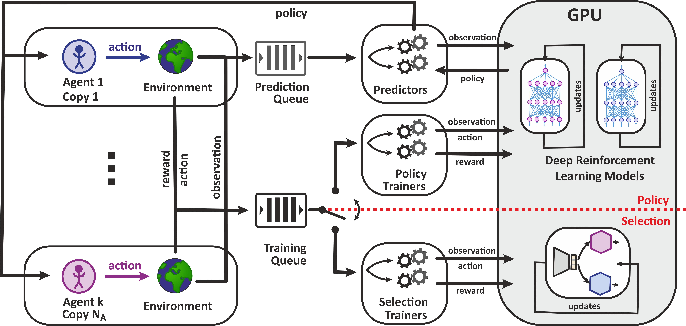
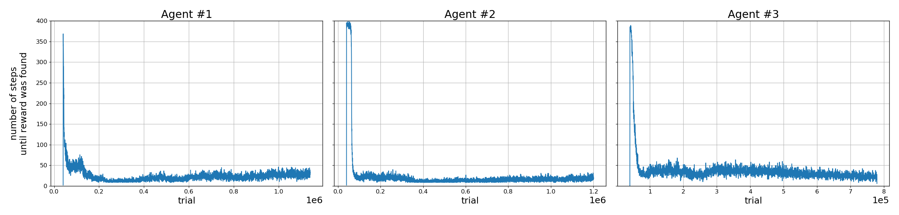
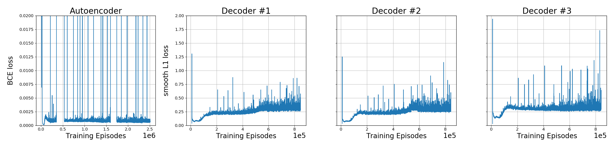

# Reinforced SciNet

This is `reinforced-scinet`, learning operationally meaningful representations of 
reinforcement learning (RL) environments.

This code accompanies our paper,

    H. Poulsen Nautrup, T. Metger, R. Iten, S. Jerbi, L.M. Trenkwalder, H. Wilming, H.J. Briegel and R. Renner
    Operationally meaningful representations of physical systems in neural networks,
    arXiv:2001.00593 [quant-ph] (2020).

If you use any of the code, please cite our paper.
Here, we provide the [PyTorch](https://pytorch.org/) code for the examples from Sec. 6 of the paper and beyond. 
In particular, this repository contains:

1. Code for asynchronous RL with deep energy-based projective simulation models.
2. Code for asynchronous representation learning as described in the paper.
3. Trained models along with detailed results from the evaluation of the model.

The code for the examples that do not involve RL can be found 
[here](https://github.com/tonymetger/communicating_scinet). 

Enjoy!

## Architecture

The asynchronous architecture is inspired by [GA3C](https://github.com/NVlabs/GA3C). 
In `policy` mode we train various deep energy-based projective simulation (DPS) models on the same environment 
but with different objectives.
In `selection` mode we use neural networks to encode and decode observations received from a RL environment.
The decoders either predict the behavior of trained RL agents or reproduce the observation like an autoencoder.
The architecture is designed to be asynchronous and may make use of a GPU. A more detailed description can be found 
in the paper.
The specific architecture can be illustrated as follows:

## Example

In the paper, we demonstrate representation learning for a sub-grid world environment. 
Here, we describe how you may reproduce those results.
The code for the environment can be found [here](https://github.com/HendrikPN/gym-subgridworld/).

Chances are that your local computer cannot run the code with the same parameters that we used. 
You can decrease the workload by reducing the number of  processes in the `config.py`.
That is, you need to lower the `WORKERS`, `TRAINERS` and `PREDICTORS` parameters.
If you can't use a GPU, you can change the `DEVICE` to `cpu`. However, we have not thoroughly tested this.

As described above, we split the training into two modes.

### Policy mode

In this training mode, we train the DPS agents on the RL environment.
For the results, we first trained three DPS agents to solve the sub-grid world environment. 
The parameters can be found in the `config.py` file. In order to reproduce the results, you need to switch `TRAIN_MODE` 
from `selection` to `policy` mode, set `LOAD_PS` to `False` for all agents, and run the code for 3M episodes.
For your convenience, we already provide the pretrained agents in the `load_models` folder. When training these agents,
they performed as follows:

### Selection mode

In this training mode, we train decoders to predict behavior of DPS agents or reproduce the input.
This is the current setting of the code and can be immediately performed by running `bash _run.sh` or `python main.py`
in the main directory.
That is, if you run the code as is, you will start training one autoencoder and three decoders to predict the behavior 
of the pretrained DPS agents. 
At the same, selection neurons will pressure the encoder to create a representation of the observation that can be 
shared among decoders efficiently.
In obtaining the results in the paper, we observed the following loss:

